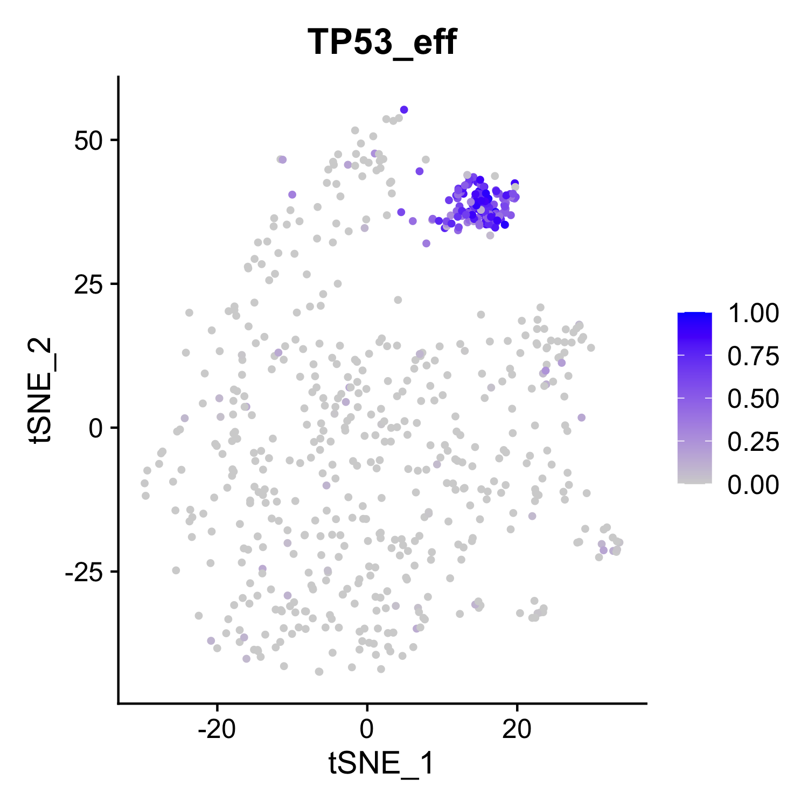

# Perturbation-response Score (PS) analysis
Perturbation-response Score (PS) analysis is a method to quantify diverse perturbation responses and discover novel biological insights in single-cell perturbation datasets.

The definition of perturbation is broad and can be any type of perturbation including genetic, chemical, environmental or mechanical perturbations. 
In particular, PS can be used to analyze heterogeneity of perturbation responses from the following data types:

- single-cell CRISPR screen (e.g., Perturb-seq, CROP-seq, ECCITE-seq);
- single-cell RNA-seq of one perturbation (e.g., gene knockout, drug treatment);
- a multiplex single-cell RNA-seq data containing a few of such perturbations.

## Contents
* Installation
* Demo
  - Demo 1: a simple example
  - Demo 2: run from count matrix generated by 10X platform
* Documentation
* References

## Installation

PS has been implemented in R as part of our [scMAGeCK](https://bitbucket.org/weililab/scmageck/src/master/) package. To use, simply install scMAGeCK in one of the following ways.

## Dependencies 

scMAGeCK depends on the following softwares or packages.

* R 
* [Seurat](https://satijalab.org/seurat/)

Follow the instructions of [Seurat installation](https://satijalab.org/seurat/install.html).

## Method 1: Install via our GitHub repository (recommended)

Our [Github](https://github.com/weililab/scMAGeCK) repo is created specifically for an easy installation of scMAGeCK R package. Use the following command in R to install:

    library(devtools)
    install_github('weililab/scMAGeCK')
    
## Method 2: download and install directly from github

First, download scMAGeCK R source code from github [scmageck](https://github.com/weililab/scMAGeCK) repository.

Second, in the command line (if you are using RStudio, open your RStudio and click on the "Terminal" tab which is next to the Console tab), type the following command:

    cd scMAGeCK_package_folder
    
    R CMD INSTALL scMAGeCK_0.99.15.tar.gz

Note: "R CMD install" may not work; use "R CMD INSTALL".

# Demos

## Demo 1: run a simple demo

This demo provides a mini example to run PS score. 

In the terminal, go to demo1 folder, initiate R, and use the following command in R 

    >source('ps_demo.R') 

to run the demo. The key steps of PS calculation involves calculating PS scores using the following command:

    eff_object <- scmageck_eff_estimate(rds_object, bc_frame, perturb_gene='TP53', 
                                    non_target_ctrl = 'NonTargetingControlGuideForHuman')

where you need to provide 4 required parameters:

* rds_object: a seurate object
* bc_frame: a barcode table (see Documentation below for format specification)
* perturb_gene: the gene label to be perturbed
* non_target_ctrl: the negative control label

The return values of this function include the PS score matrix, and a new RDS object containing the PS scores of perturbations as a column in metadata:

    eff_estimat=eff_object$eff_matrix
    rds_subset=eff_object$rds

You can visualize the PS score using the following command:

    FeaturePlot(rds_subset,features='TP53_eff',reduction = 'tsne')

You should be able to see figures like this:

*Note*: this mini dataset is provided for users to run the pipeline. 
To reduce file size, only a few gene expressions are non-zero. For accurate results, run the pipeline with the full dataset. 

## Demo2: run from read count matrix generated by 10X platform

This demo is a small BeeSTING-seq dataset from [Morris et al Science 2023](https://www.science.org/doi/10.1126/science.adh7699). 
The BeeSTING-seq experiment is performed using 10X Genomics 5' protocol.
The data is downloaded from the following GEO: [GSE171452](https://www.ncbi.nlm.nih.gov/geo/query/acc.cgi?acc=GSE171452).
We will demonstrate how to run scMAGeCK/PS pipeline from count matrix files generated by 10X.

An R markdown file and the complied html file is provided.
To run this demo, open the R markdown file on RStudio, and run all the R scripts to reproduce results.

# Documentation

A detailed documentation of the methods can be found in scMAGeCK R package. 
In particular, scmageck_eff_estimate is the core function to estimate PS scores. Simply type

    >?scmageck_eff_estimate 

to learn how to use this function.

## barcode file

This file is inherited from scMAGeCK to record the guides (or perturbations) for each single cell. This is tab-sepraated text file with an example shown below:

    cell    barcode sgrna   gene    read_count      umi_count
    AAATCAACGGGTGA-1        NF1_sg_118      AGTCAGTACTGAGCACAACA    NF1     1187    30
    AAATCAACGGGTGA-1        CDKN2A_sg_70    TCTTGGTGACCCTCCGGATT    CDKN2A  1       1
    AAATCAACGGGTGA-1        SETD2_sg_157    AGTTCTTCTCGGTGTCCAAA    SETD2   1       1
    AAATCAACGGGTGA-1        ARID1B_sg_14    GGAAGCAACCAGTCTCGATC    ARID1B  1       1

In cases you get the sgRNA read count matrix, you can use guidematrix_to_triplet function in scMAGeCK to convert them into this file type. An example code is shown below. 

    bc_frame=guidematrix_to_triplet(sobj[['CRISPR']]@counts,sobj) # assuming guide expression matrix is stored in a Seurat object named sobj
    bc_frame[,'sgrna']=bc_frame[,'barcode'] # here you can use barcode label as sgrna label
    bc_frame[,'gene']=sub('-[0-9]+$','',bc_frame[,'barcode']) # some barcode label contains gene information, so some string operation is sufficient to get gene label

# References

Please cite the following paper if you would like to reference our PS method.

* Song et al. Decoding Heterogenous Single-cell Perturbation Responses. bioRxiv 2023, 10.30.564796. [DOI](https://doi.org/10.1101/2023.10.30.564796) [bioRxiv](https://www.biorxiv.org/content/10.1101/2023.10.30.564796v1)

